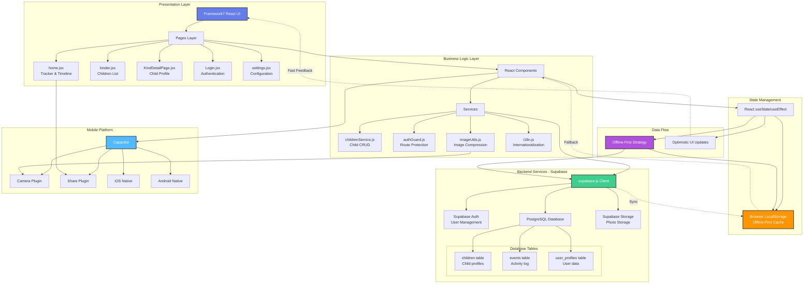

# SitterSafe - Babysitter App

> 🛡️ **Sichere Kinderbetreuung leicht gemacht**

Eine moderne Progressive Web App (PWA) für Babysitter mit vollständiger Backend-Integration über Supabase.

## ✨ Features

- 🔐 **Benutzer-Authentifizierung** (Magic Link + Email/Passwort)
- 📊 **Aktivitäts-Tracker** (Essen, Schlaf, Windel, Spiel)
- 👶 **Kinderprofile** mit Gesundheitsinformationen
- ☁️ **Cloud-Synchronisation** mit Supabase
- 📴 **Offline-First** mit lokalem Fallback
- 🌍 **Mehrsprachig** (Deutsch & Englisch)
- 🎨 **Modern UI** mit Framework7

## 🏗️ Architecture

Die App folgt einer mehrschichtigen Architektur mit Offline-First-Strategie:



**Architektur-Highlights:**
- 🔄 **Offline-First**: LocalStorage als primärer Cache, Supabase-Sync im Hintergrund
- ⚡ **Optimistic UI**: Sofortige UI-Updates für bessere UX
- 📱 **Cross-Platform**: Web/PWA, iOS & Android via Capacitor
- 🔒 **Row Level Security**: Datenschutz auf Datenbank-Ebene

## 🚀 Supabase Backend-Integration

Diese App nutzt **Supabase** als Backend für:
- Authentifizierung & User Management
- PostgreSQL-Datenbank mit Row Level Security
- Cloud-Backup & Synchronisation
- Offline-First-Architektur

**📖 Siehe [MIGRATION_GUIDE.md](./MIGRATION_GUIDE.md) für Setup-Anleitung!**

---

## Framework7 CLI Options

Framework7 app created with following options:

```
{
  "cwd": "/Users/d0304104/Library/CloudStorage/OneDrive-dmdrogerie/Studium - Master/Mobile Business Apps/BabysittingApp",
  "type": [
    "pwa"
  ],
  "name": "Babysitter",
  "framework": "react",
  "template": "tabs",
  "bundler": "vite",
  "cssPreProcessor": false,
  "theming": {
    "customColor": true,
    "color": "#00e1ff",
    "darkMode": false,
    "iconFonts": true
  },
  "customBuild": false
}
```

## Install Dependencies

First of all we need to install dependencies, run in terminal
```
npm install
```

## NPM Scripts

* 🔥 `start` - run development server
* 🔧 `dev` - run development server
* 🔧 `build` - build web app for production

## Vite

There is a [Vite](https://vitejs.dev) bundler setup. It compiles and bundles all "front-end" resources. You should work only with files located in `/src` folder. Vite config located in `vite.config.js`.

## PWA

This is a PWA. Don't forget to check what is inside of your `service-worker.js`. It is also recommended that you disable service worker (or enable "Update on reload") in browser dev tools during development.
## Assets

Assets (icons, splash screens) source images located in `assets-src` folder. To generate your own icons and splash screen images, you will need to replace all assets in this directory with your own images (pay attention to image size and format), and run the following command in the project directory:

```
framework7 assets
```

Or launch UI where you will be able to change icons and splash screens:

```
framework7 assets --ui
```


## Documentation & Resources

* [Framework7 Core Documentation](https://framework7.io/docs/)

* [Framework7 React Documentation](https://framework7.io/react/)

* [Framework7 Icons Reference](https://framework7.io/icons/)
* [Community Forum](https://forum.framework7.io)

## Support Framework7

Love Framework7? Support project by donating or pledging on:
- Patreon: https://patreon.com/framework7
- OpenCollective: https://opencollective.com/framework7